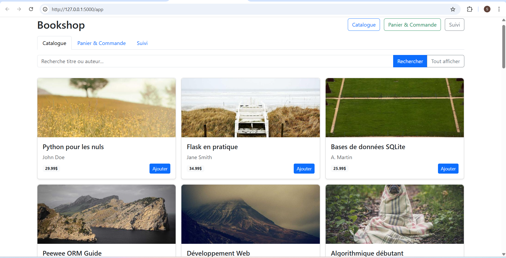
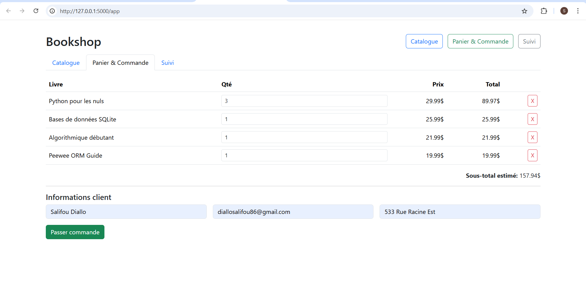
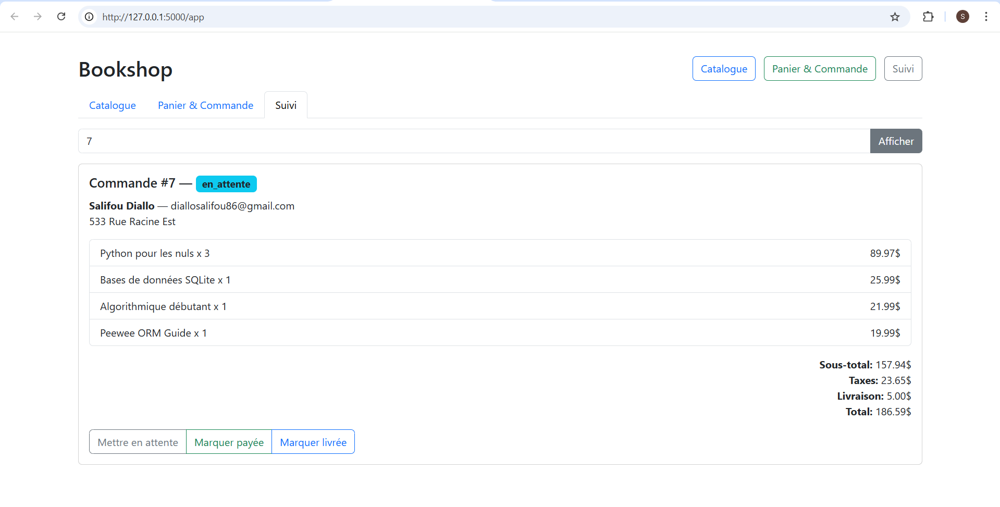

# 📚 Bookshop – Application web de gestion de livres

Ce projet a été réalisé dans le cadre du cours **8INF700 – Sujet spécial en informatique**.

L'objectif était de développer une **application web locale** permettant :

- de consulter un **catalogue de livres**
- de créer des **commandes**
- de suivre le **statut des commandes**

L'application utilise un **backend Flask (Python)** avec **Peewee ORM** et une base de données **SQLite**.  
Le frontend est développé en **HTML / CSS / JavaScript** avec **Bootstrap**.

---

# Aperçu de l'application

## Catalogue des livres

Les utilisateurs peuvent consulter les livres disponibles et effectuer une recherche par **titre ou auteur**.

---

## Panier et commande

Les livres peuvent être ajoutés au **panier**, puis une commande peut être créée avec les informations du client.

---

## Suivi des commandes

Les commandes peuvent être recherchées par **ID** et leur statut peut être mis à jour :

- `en_attente`
- `payee`
- `livree`

---

# Fonctionnalités principales

## Catalogue

- Affichage de tous les livres disponibles
- Recherche par **titre** ou **auteur**
- Indication de disponibilité
- Ajout d'un livre au panier

## Panier et commande

Le panier est stocké côté client avec **localStorage**.

Fonctionnalités :

- modification des quantités
- suppression d'articles
- formulaire client (nom, email, adresse)
- création d'une commande via l'API Flask

Calcul automatique :

- sous-total
- taxes
- frais de livraison

---

# Technologies utilisées

## Backend

- Python 3
- Flask
- Peewee ORM
- SQLite

## Frontend

- HTML5
- CSS3
- Bootstrap 5
- JavaScript (ES modules)

---

# Architecture du projet

bookshop/
│
├── backend/
│ ├── app.py # routes Flask (livres, commandes)
│ ├── models.py # modèles Peewee
│ ├── database.py # configuration SQLite
│ ├── config.py # constantes (taxes, livraison, debug)
│ └── requirements.txt
│
├── backend/scripts/
│ └── seed.py # insertion de livres de démonstration
│
├── frontend/
│ ├── app.html # page principale
│ ├── css/styles.css
│ └── js/api.js # appels API (fetch)
│
└── README.md

---

# Installation et exécution

## 1️⃣ Cloner le projet
git clone <url-du-repo>
cd bookshop

---

## 2️⃣ Créer l'environnement Python (optionnel)

Linux / macOS
python -m venv venv
source venv/bin/activate

Windows
python -m venv venv
venv\Scripts\activate

---

## 3️⃣ Installer les dépendances
pip install -r backend/requirements.txt

---

## 4️⃣ Lancer l'application
python -m backend.app

L'application démarre sur :
http://127.0.0.1:5000/app

---

# Base de données et données de test
Pour remplir la base avec des livres de démonstration :
python -m backend.scripts.seed

Environ **30 livres** sont automatiquement insérés.

---

# Objectif pédagogique

Le projet fonctionne **entièrement en local** et a été conçu pour mettre en pratique :

- la création d'une **API REST avec Flask**
- l'utilisation d'un **ORM (Peewee)**
- la gestion d'une **base SQLite**
- la création d'un **frontend simple avec Bootstrap**

L'objectif principal était de comprendre l'intégration **backend + base de données + interface web** dans une application complète.
