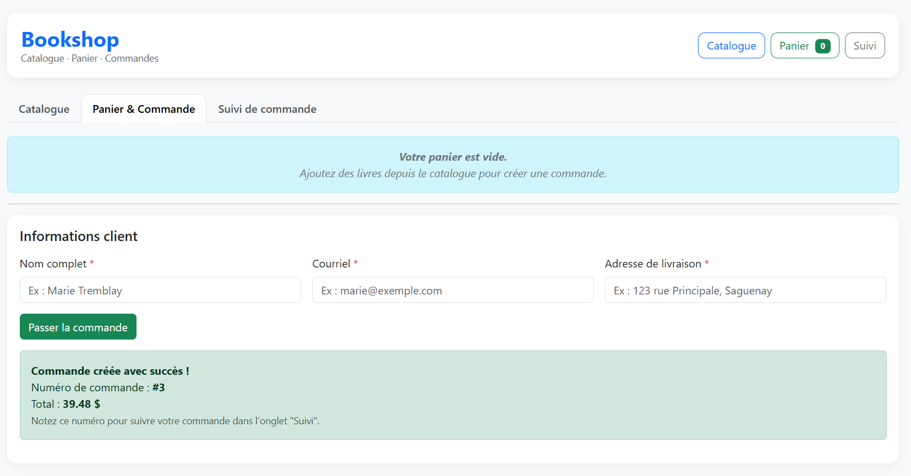
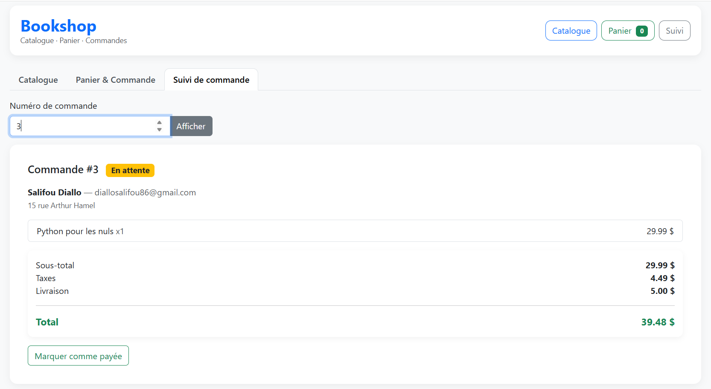

# 📚 Bookshop — Application web de gestion de commandes


> Application web locale de gestion de librairie avec catalogue, panier, commandes et suivi de statut.  
> Réalisée dans le cadre du cours **8INF206** — UQAC, Session Hiver 2026.

---

## 📋 Table des matières

- [Aperçu](#-aperçu)
- [Captures d'écran](#-captures-décran)
- [Fonctionnalités](#-fonctionnalités)
- [Stack technique](#-stack-technique)
- [Structure du projet](#-structure-du-projet)
- [Installation](#-installation-et-démarrage)
- [Tests](#-lancer-les-tests)
- [API REST](#-api-rest--référence)
- [Choix techniques](#-choix-techniques)

---

## 🖥️ Aperçu

Bookshop est une **Single Page Application (SPA)** permettant de gérer une librairie en ligne de bout en bout :

- 📖 Consulter un catalogue de 30 livres avec recherche et filtres
- 🛒 Gérer un panier et passer des commandes
- 🔍 Suivre l'état d'une commande par identifiant
- ✅ Mettre à jour le statut d'une commande (en attente → payée → livrée)

---

## 📸 Captures d'écran

**Catalogue de livres**


**Panier et commande**


**Suivi de commande**


---

## ✨ Fonctionnalités

- **Catalogue** : liste, recherche, filtre par disponibilité
- **Commandes** : création avec calcul automatique des taxes québécoises (TPS + TVQ)
- **Suivi** : consultation et mise à jour du statut avec transitions contrôlées
- **Sécurité** : en-têtes HTTP de sécurité sur chaque réponse
- **API REST** : retourne toujours du JSON, même pour les erreurs
- **Tests** : 38 tests unitaires avec base SQLite en mémoire isolée

---

## 🛠️ Stack technique

| Couche | Technologie |
|---|---|
| Backend | Python 3.12 + Flask 3.0 |
| ORM | Peewee 3.17 |
| Base de données | SQLite (mode WAL) |
| Frontend | HTML5 / CSS3 / JavaScript ES2023 |
| UI | Bootstrap 5.3 |
| Tests | pytest 8.2 |
| Config | python-dotenv |
| Versionnement | Git / GitHub |

---

## 📁 Structure du projet

```
bookshop/
├── .env.example                  # Modèle de configuration
├── .gitignore
├── README.md
├── backend/
│   ├── app.py                    # Routes Flask, logging, sécurité, gestion d'erreurs
│   ├── models.py                 # Modèles Peewee (Livre, Client, Commande, CommandeLivre)
│   ├── database.py               # Configuration SQLite (WAL, FK, cache)
│   ├── config.py                 # Constantes chargées depuis .env
│   ├── requirements.txt
│   └── scripts/
│       └── seed.py               # Insertion de 30 livres de démonstration
├── frontend/
│   ├── app.html                  # Interface SPA
│   ├── css/styles.css
│   └── js/api.js                 # Couche d'accès à l'API (fetch)
├── tests/
│   ├── conftest.py               # Fixture pytest — BD SQLite en mémoire
│   ├── test_books.py             # 17 tests — routes /books
│   └── test_orders.py            # 21 tests — routes /orders
└── uml/
    ├── bookshop_classes.puml
    ├── bookshop_sequence_commande.puml
    └── bookshop_sequence_suivi.puml
```

---

## 🚀 Installation et démarrage

### 1. Cloner le projet

```bash
git clone https://github.com/SalifouDiallo/bookshop.git
cd bookshop
```

### 2. Créer un environnement virtuel

```bash
python -m venv venv

# Windows
venv\Scripts\activate

# Linux / macOS
source venv/bin/activate
```

### 3. Installer les dépendances

```bash
pip install -r backend/requirements.txt
```

### 4. Configurer l'environnement (optionnel)

```bash
cp .env.example .env
# Modifier .env selon vos besoins
```

### 5. Insérer les données de démonstration

```bash
python -m backend.scripts.seed
```

> Insère 30 livres avec titres, auteurs, descriptions et images.

### 6. Lancer l'application

```bash
python -m backend.app
```

🌐 Accès : [http://127.0.0.1:5000/app](http://127.0.0.1:5000/app)

---

## 🧪 Lancer les tests

```bash
# Lancement standard
pytest

# Mode verbeux
pytest -v

# Résumé court
pytest -q
```

> Les tests utilisent une base SQLite **en mémoire**, entièrement isolée entre chaque test.

### Résultats

| Fichier | Tests ✅ | Tests ❌ | Total |
|---|:---:|:---:|:---:|
| `test_books.py` | 9 | 8 | 17 |
| `test_orders.py` | 8 | 13 | 21 |
| **Total** | **17** | **21** | **38** |

---

## 📡 API REST — Référence

### 📖 Livres

| Méthode | Route | Description |
|---|---|---|
| `GET` | `/books` | Liste les livres (`?search=`, `?disponible=true`) |
| `GET` | `/books/<id>` | Détail d'un livre |
| `POST` | `/books` | Créer un livre |
| `PUT` | `/books/<id>` | Modifier un livre |
| `DELETE` | `/books/<id>` | Supprimer un livre |

### 🧾 Commandes

| Méthode | Route | Description |
|---|---|---|
| `GET` | `/orders` | Liste paginée (`?page=`, `?limit=`, `?statut=`) |
| `POST` | `/orders` | Créer une commande |
| `GET` | `/orders/<id>` | Détail d'une commande |
| `PUT` | `/orders/<id>/status` | Mettre à jour le statut |

### Exemple — Créer une commande

```bash
POST /orders
Content-Type: application/json

{
  "client": {
    "nom": "Alice Tremblay",
    "email": "alice@exemple.com",
    "adresse": "123 rue Racine, Chicoutimi, QC"
  },
  "items": [
    { "book_id": 1, "quantite": 2 },
    { "book_id": 5, "quantite": 1 }
  ]
}
```

### Transitions de statut autorisées

```
en_attente ──► payee ──► livree
```

---

## 💡 Choix techniques

**Prix en centimes** — Les montants sont stockés en entiers pour éviter les erreurs d'arrondi. Ex : `2999` = 29,99 $.

**Taxes québécoises** — Le taux combiné de 14,975 % (TPS 5 % + TVQ 9,975 %) est centralisé dans `config.py` et configurable via `.env`.

**En-têtes de sécurité** — Chaque réponse inclut `X-Content-Type-Options`, `X-Frame-Options` et `Referrer-Policy`.

**Logging structuré** — Tous les événements importants (créations, erreurs, démarrage) sont tracés avec horodatage.

**WAL mode** — SQLite est configuré en Write-Ahead Logging pour de meilleures performances en lecture/écriture concurrente.

**Erreurs JSON** — Toutes les erreurs HTTP (400, 404, 405, 500) retournent du JSON, jamais du HTML.

---

## 👤 Auteur

**Salifou Diallo**  
Étudiant en informatique — UQAC  
[](https://www.linkedin.com/in/salifou-diallo-3117702b2/)
[](https://github.com/SalifouDiallo)
